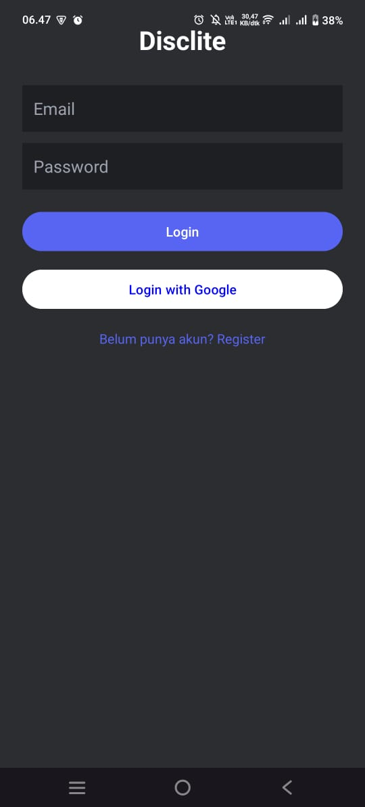
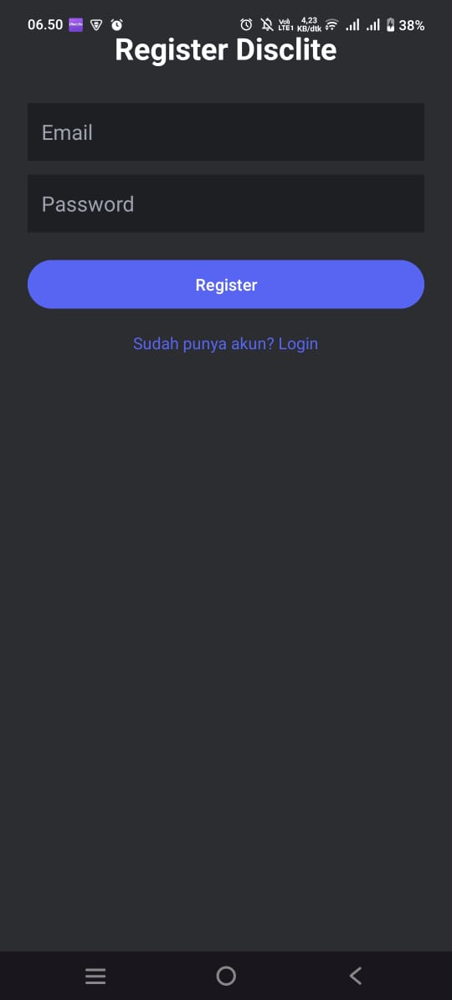
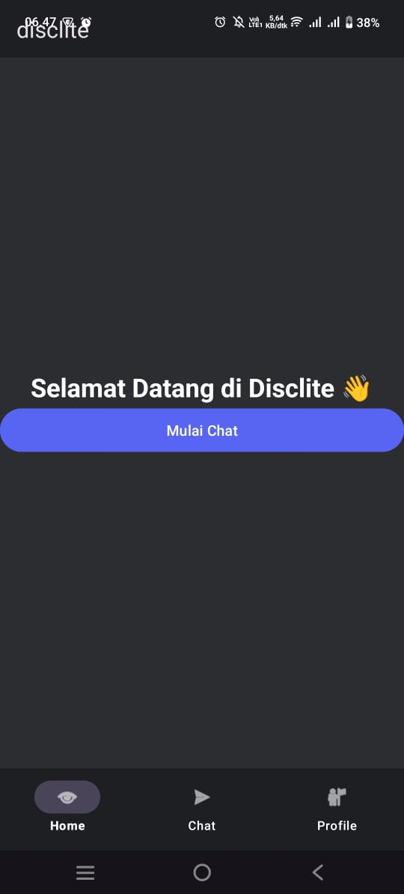
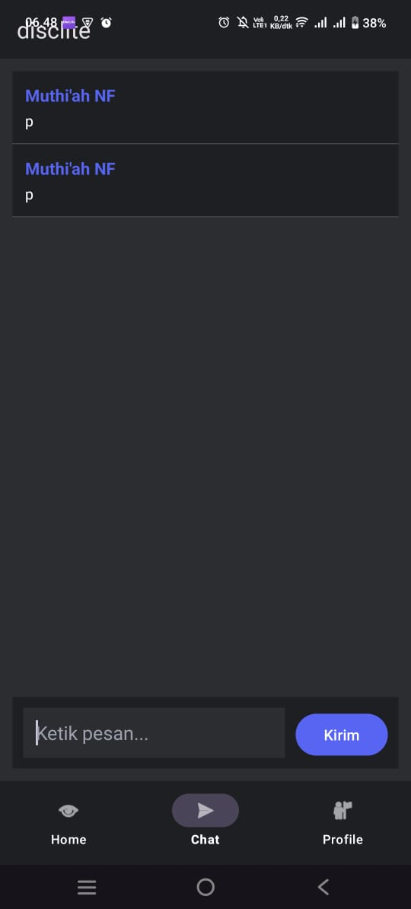
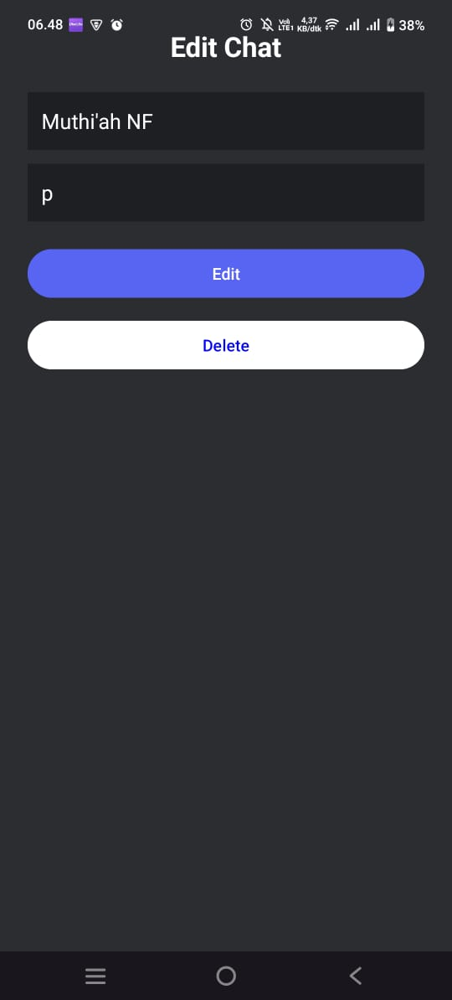

# desclite - Mobile Application

## Identitas
- **Nama:** [Muthi'ah Nur Fauziah]
- **NIM:** [2304411398]
- **Kelas:** [5J RPL GAB 2]

## Tema & Referensi Aplikasi
- **Tema:** Aplikasi Chatting (disclite)
- **Aplikasi Rujukan:** Discord
- **Link Play Store:** [https://play.google.com/store/apps/details?id=com.instagram.barcelona]

## Fitur Aplikasi (Ceklist)
- [x] Login
- [x] Register
- [x] Home (Menampilkan selamat datang dan button untuk mulai chat)
- [x] Create (Membuat chat)
- [x] Edit/Update (Edit/Update chat)
- [x] Profil (Menampilkan profil)
- [x] Notifikasi (Pemberitahuan notifikasi chat)

## Screenshots Tampilan
| Login | Register | Home | Create |
|  |  |  |  |

| Edit_update_delete | Profil |
|  | | 

## Cara Menjalankan Aplikasi
1. Clone repository ini melalui terminal: git clone https://github.com/muthiahfauziah7-prog/disclite.git
2. Buka proyek menggunakan Android Studio
3. Pastikan gradle sinkronisasi selesai
4. jalankan aplikasi menggunakan emulator atau perangkat fisik (run button)
